# Udacity Track an Object in 3D Space - Final Project

## FP.1 Match 3D Objects

/*
void matchBoundingBoxes(std::vector<cv::DMatch> &matches, std::map<int, int> &bbBestMatches, DataFrame &prevFrame, DataFrame &currFrame)
*/

Implemented method "matchBoundingBoxes", that:  

    1. loops thru all bounding boxes in one frame. For each frame, extract all keypoints in the current bounding box.

    2. loops thru all boundinx boxes in 2nd frame and determine which one has the highest # of keypoints among all keypoins identified in step 1.

    3. match these 2 frames and repeat step 1-2.

## FP.2 Compute Lidar-based TTC

/*
void computeTTCLidar(std::vector<LidarPoint> &lidarPointsPrev,
                     std::vector<LidarPoint> &lidarPointsCurr, double frameRate, double &TTC)
*/
Implemented method "computeTTCLidar":

    1. Given 2 data frames, all the lidar points are sorted first in each frame based on the x value ( distance to host in x direction) for the purpose of eliminating outliers.

    2. median values is extracted and TTC is calculated based on constant velocity model.

## FP.3 Associate Keypoint Correspondences with Bounding Boxes

/*
void clusterKptMatchesWithROI(BoundingBox &boundingBox, std::vector<cv::KeyPoint> &kptsPrev, std::vector<cv::KeyPoint> &kptsCurr, std::vector<cv::DMatch> &kptMatches)
*/

Implemented method "clusterKptMatchesWithROI":

    1. Loops thru all the matched keypoints from descriptor extraction function.
    
    2. Calculate euclidean distance of every keypoint and determine median value of all the results in order to eliminate exclude outliers.

    3. Add matched keypoints to the bounding box if they are in the roi area.

## FP.4 Compute Camera-based TTC

/*
void computeTTCCamera(std::vector<cv::KeyPoint> &kptsPrev, std::vector<cv::KeyPoint> &kptsCurr,
                      std::vector<cv::DMatch> kptMatches, double frameRate, double &TTC, cv::Mat *visImg)
*/

Implemented method "ComputeTTCCamera":

    1. Loops thru all matched keypoints in 2 consecutive frames, and calculate euclidean distance between 2 keypoints.

    2. Extract the median value to avoid outliers and compute TTC based on constant velocity model.

## FP.5 Performance Evaluation #1

In certain cases the accuracy of Lidar-based TTC estimation is not desired due to outliers. However the outliers could be eliminated by filtering techniques such as taking median or mean values of all point cloud data.

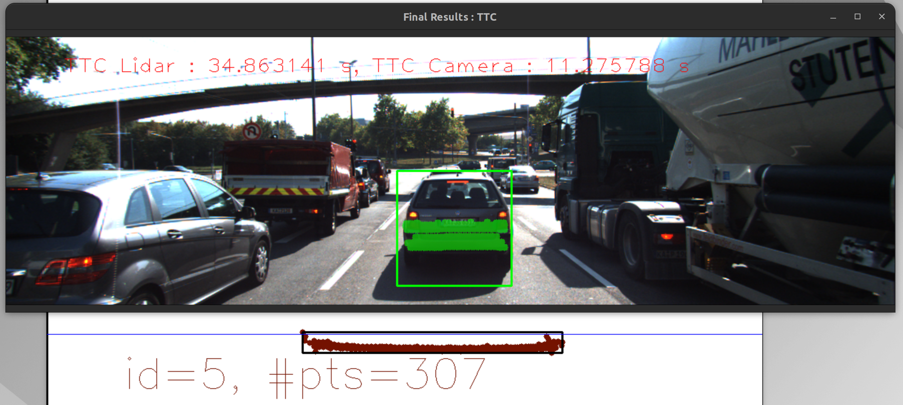
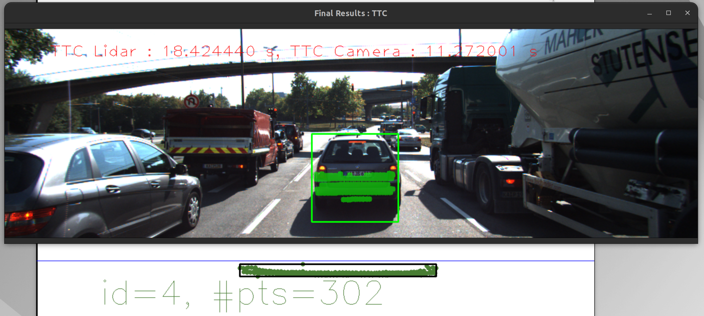
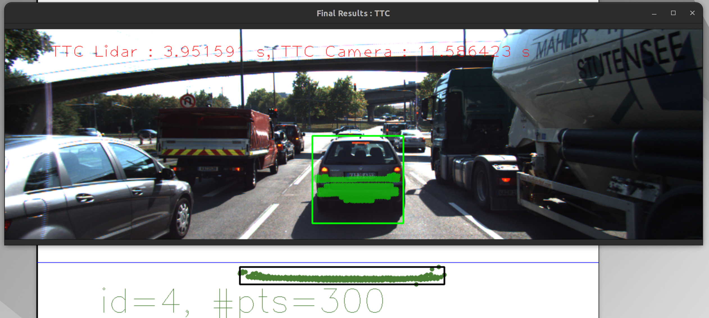

In addition, both Lidar and Camera based TTC implemented in this project are based on CVM ( constatn velocity model ) which would:
     1. Over-estimate TTC in a deceleration scenario. ( Actual relative v > CVM estimated v )
     2. Under-estimate TTC in an acceleration scenario. ( Actual relative v < CVM estimated v )

In the CVM, relative velocity is assumed constant; In the CAM, <current relative velocity> = <previous velocity> - <acceleration> * <time step>. In this project, from the images we can tell that the preceding vehicle is braking ( decelerating ) while approaching the traffic light. In this case, acceleration in the equation above is negative and it results in greater relative velocity than the previous velocity value; Therefoce, the actual TTC based on CAM would be smaller than the estimated TTC by CVM.

## FP.6 Performance Evaluation #1

Combinations of different vision detectors and descriptors from the following collections are evaluated in this project:

Detectors: SHITOMASI, HARRIS, FAST, BRISK, ORB, AKAZE, SIFT

Descriptors: BRISK, BRIEF, ORB, FREAK, AKAZE, SIFT

TTC results are as follow:

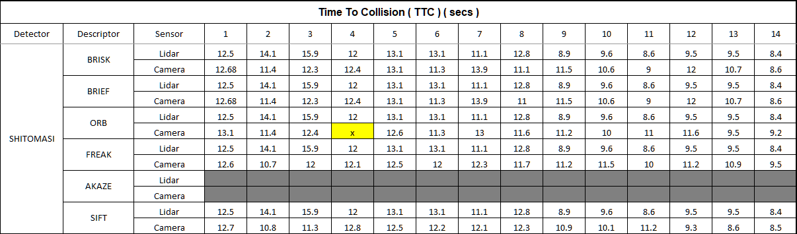
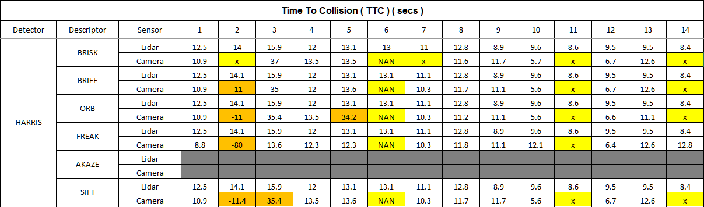
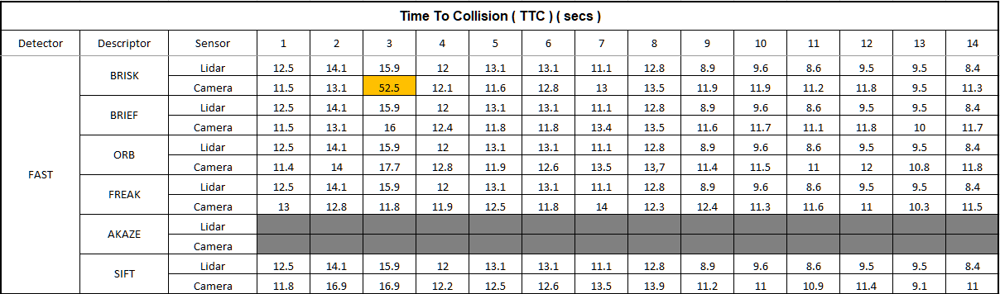
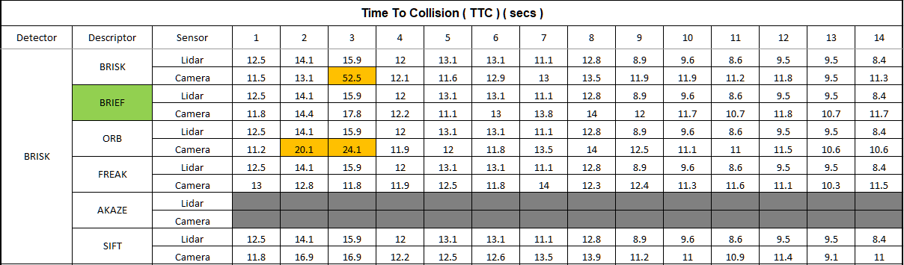
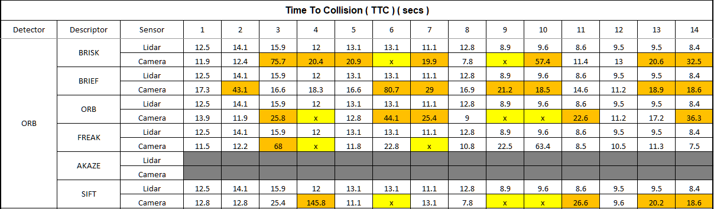
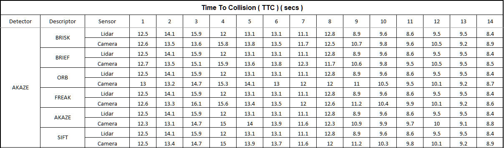
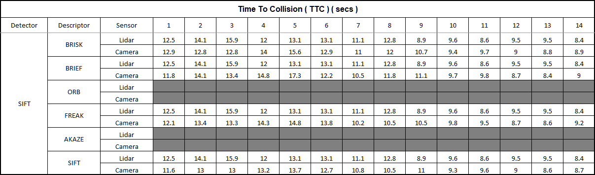

Based on the results above, it concludes that the combination of FAST + BRIEF perform the best with regards to estimation accuracy and runtime performance. There are some other detectors / descriptors such as SHITOMASI and SIFT, which also deliver decent accuracy. However, they are not suitable for real-time application due to the computation cost and efficiency.

There are multiple frames observed that camera TTC is way off as below. It is important to select the proper detector and descriptor to perform visual-based feature detection and tracking.

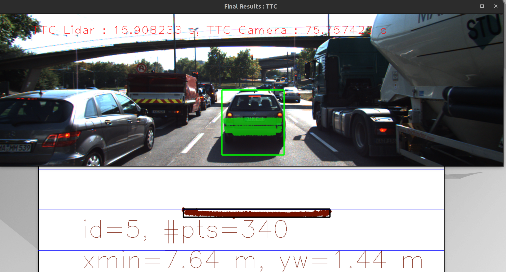
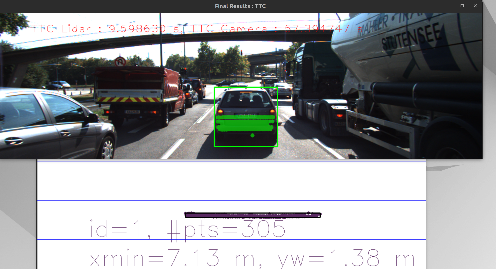
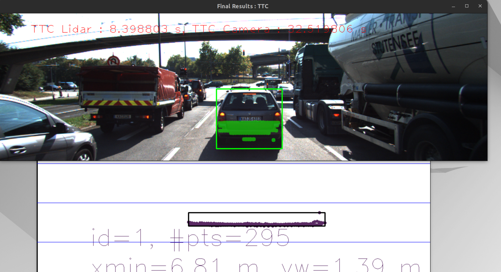

